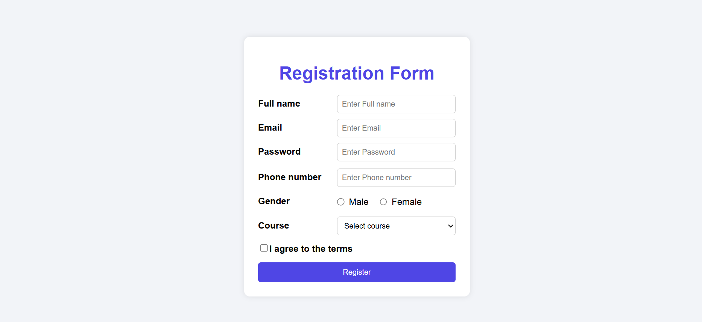
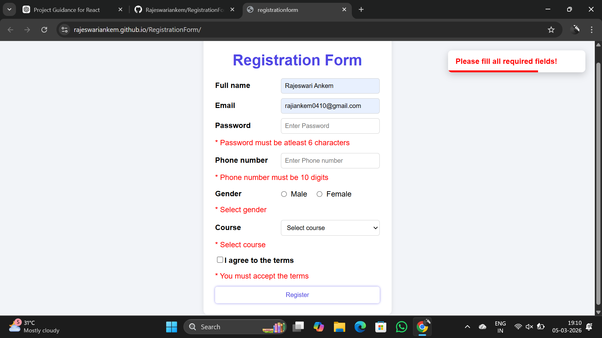
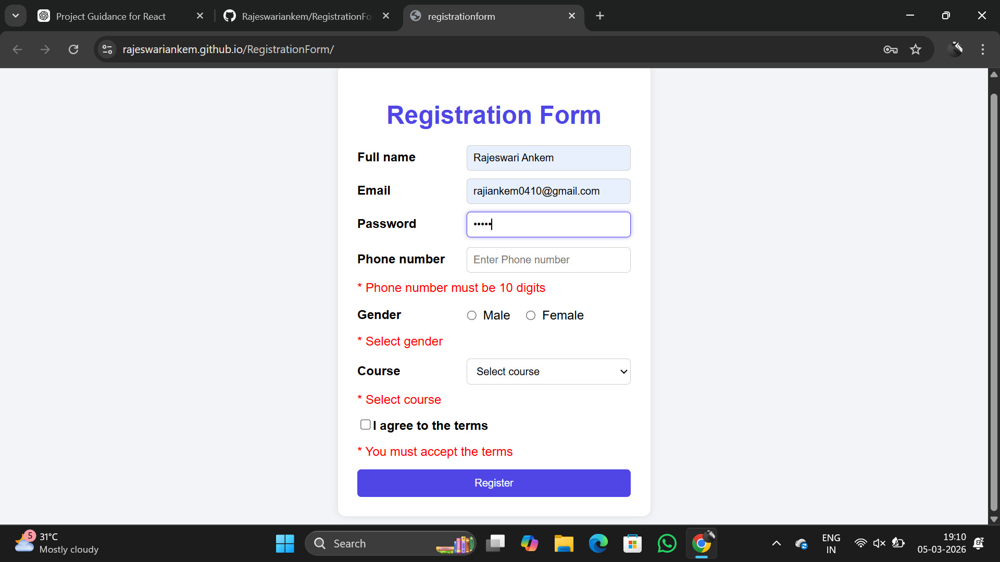
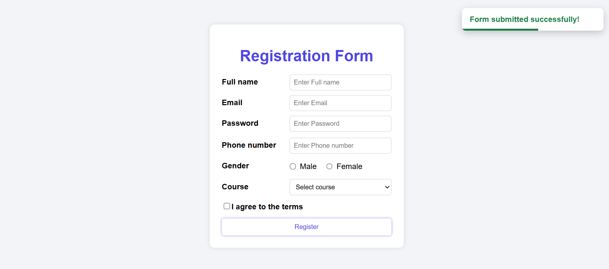

# 📝 React Registration Form

A simple **Registration Form built with React** as part of a **college mini project** and also for practicing React concepts like form handling, validation, and UI feedback.

🔗 **Live Demo:**  
https://rajeswariankem.github.io/RegistrationForm/

---

## 📌 Project Overview

This project is a **React-based Registration Form** that collects user details and validates the inputs before submission.

The form asks for the following details:

- 👤 Full Name  
- 📧 Email  
- 🔐 Password  
- 📱 Phone Number  
- ⚧ Gender  
- 🎓 Course Selection  
- ☑ Agreement to Terms & Conditions  

When the **Register button** is clicked, the application checks the form inputs and provides **instant feedback**.

---

## ✨ Features

✅ Controlled form inputs using **React useState**  
✅ Field validation for each input  
✅ Error messages displayed for invalid inputs  
✅ Error messages disappear automatically when the user starts typing  
✅ Toast notification system for feedback  
✅ Animated progress line in toast message  
✅ Success message when the form is submitted correctly  
✅ Error message when required fields are missing  
✅ Clean and responsive UI design

---

## ⚙️ Validation Rules

The form validates the following conditions:

- 👤 **Name** cannot be empty  
- 📧 **Email** must be in correct email format  
- 🔐 **Password** must contain **at least 6 characters**  
- 📱 **Phone number** must contain **exactly 10 digits**  
- ⚧ **Gender** must be selected  
- 🎓 **Course** must be selected  
- ☑ **Terms & Conditions** must be accepted  

If any of these validations fail, an **error message appears below the respective field**.

When the user starts typing or correcting the input, the error message **automatically disappears**.

---

## 🔔 Toast Notification

After clicking the **Register** button:

✔ If the form is valid  
➡ **Success Toast:**  
`Form submitted successfully!`

❌ If fields are missing or incorrect  
➡ **Error Toast:**  
`Please fill all required fields!`

The toast notification:

📍 Appears at the **top-right corner**  
📊 Contains an **animated progress line**  
⏱ Automatically disappears after a few seconds

---

## 🛠 Technologies Used

- ⚛ React
- 💻 JavaScript (ES6)
- 🌐 HTML5
- 🎨 CSS3

---

## 📸 Screenshots

### 🖥 Registration Form UI

### ⚠ Error Toast Notification

### ❌ Validation Errors

### ✅ Success Toast Notification

---
## 🎯 Learning Outcomes

Through this project I practiced several important React and frontend development concepts:

- ⚛ **React Functional Components**
- 🧠 **State management using `useState`**
- 🧾 **Controlled form components** in React
- 🔁 **Handling form events** (`onChange`, `onSubmit`)
- 🧩 **Managing multiple form inputs using a single state object**
- 🧠 **Form validation logic** for user inputs
- ❌ **Displaying dynamic error messages**
- 🔁 **Conditional rendering in React**
- 🧹 **Clearing errors dynamically when the user updates inputs**
- 🔔 **Creating a custom toast notification system**
- 🎬 **Using CSS animations for UI feedback**
- 🎨 **Styling components using CSS**
- 🚀 **Deploying a React project using GitHub Pages**
